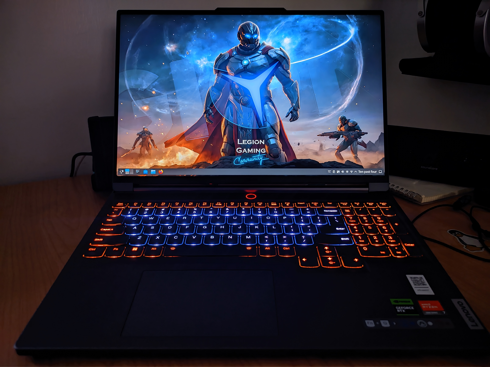

# Legion Slim 7 16APH8 on EndeavorOS




## Neofetch

```shell
prnice@legion-S7 ~> neofetch
                     ./o.                  prnice@legion-S7 
                   ./sssso-                ---------------- 
                 `:osssssss+-              OS: EndeavourOS Linux x86_64 
               `:+sssssssssso/.            Host: 82Y4 Legion Slim 7 16APH8 
             `-/ossssssssssssso/.          Kernel: 6.8.9-arch1-1 
           `-/+sssssssssssssssso+:`        Uptime: 1 hour, 14 mins 
         `-:/+sssssssssssssssssso+/.       Packages: 1138 (pacman) 
       `.://osssssssssssssssssssso++-      Shell: fish 3.7.1 
      .://+ssssssssssssssssssssssso++:     Resolution: 3200x2000 
    .:///ossssssssssssssssssssssssso++:    DE: Plasma 6.0.4 
  `:////ssssssssssssssssssssssssssso+++.   WM: kwin 
`-////+ssssssssssssssssssssssssssso++++-   Theme: Breeze-Dark [GTK2], Breeze [GTK3] 
 `..-+oosssssssssssssssssssssssso+++++/`   Icons: breeze-dark [GTK2/3] 
   ./++++++++++++++++++++++++++++++/:.     Terminal: yakuake 
  `:::::::::::::::::::::::::------``       CPU: AMD Ryzen 7 7840HS w/ Radeon 780M Graphics (16) @ 5.137GHz 
                                           GPU: AMD ATI 65:00.0 Phoenix1 
                                           Memory: 4224MiB / 31278MiB 

                                                                   
                                                                   
```


## Working

- Similar to Fedora
- Nvidia with beta drivers does not cause the laptop to overheat and power draw is reasonable
- [LenovoLegionLinux](https://github.com/johnfanv2/LenovoLegionLinux) is available and easy to install on the aur


## Not Working

- Close lid issue persists
- Speaker issue is worse
- SDDM Login screen has wrong scaling


## Workarounds

- Close lid: No good workaround but closing the lid while the laptop is asleep is the core issue as the laptop will immediately shutdown. Closing the lid when the laptop is awake and unlocked works as expected
- Speaker issue: Installing [this](https://aur.archlinux.org/packages/legion-y9000x-2022-iah7-sound-fix-dkms) package seems to fix or at least reduce the issue
- SDDM: SDDM works in X11 mode by default, enable wayland support to fix the issue https://wiki.archlinux.org/title/SDDM#Wayland


## **[optimus-manager](https://github.com/Askannz/optimus-manager)**  

Package that helps control Nvidia GPU power mode. Could not fully get it working especially with the beta drivers.


## **[envycontrol](https://github.com/bayasdev/envycontrol)**

Similar to **[optimus-manager](https://github.com/Askannz/optimus-manager)** but only has too options `integrated` and `hybrid`. In integrated mode the Nvidia GPU is completely disabled which is desired.

>  Use https://github.com/enielrodriguez/optimus-gpu-switcher for a KDE widget